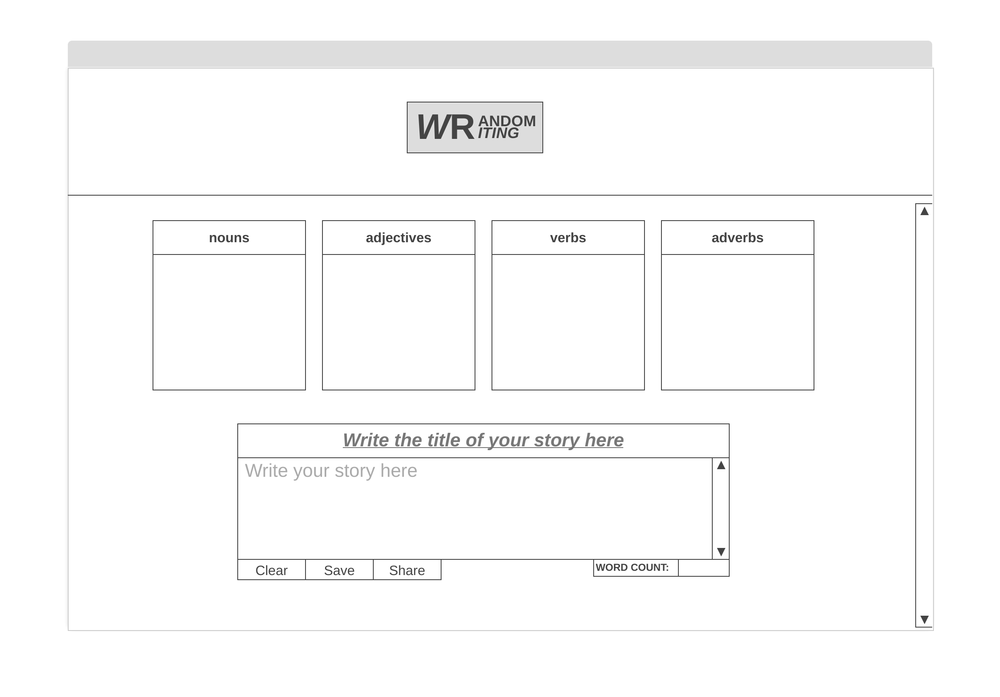
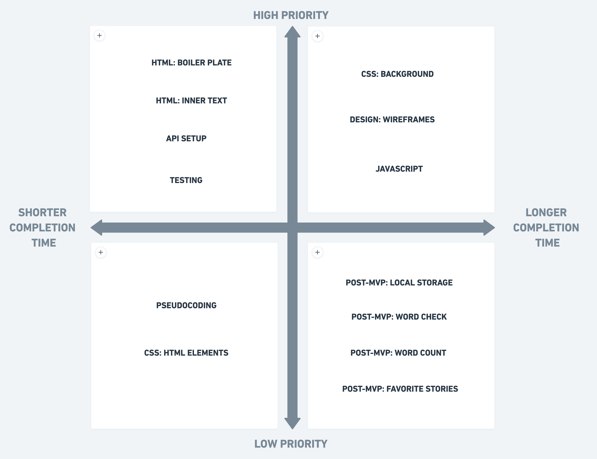

## App Title

#### Random Writing 


## App Description

*Random Writing* **generates words** belonging to the four most important word categories (nouns, adjectives, verbs and adverbs) that serve as **prompt to practice creative writing**.


## API

+ **Name**: Merriam-Webster Dictionary. 
+ **URL**: <https://dictionaryapi.com/>
+ **Information to access**: words, their category and definition.


## API Snippet

```javascript
"meta": 
  { "id":"voluminous",},
"fl":"adjective",
"def":
  [  
    {
      "sseq":
        [  
          [ 
            [
              "sense",
                {
                  "sn":"1 a",
                  "dt": 
                    [
                      [ 
                        "text", 
                        "{bc}having or marked by great {a_link|volume} or bulk {bc}{sx|large||} "
                      ],
                      [
                        "vis",
                         [
                            {"t":"long {wi}voluminous{\/wi} tresses"}
                         ]
                      ]
                    ],
                  "sdsense":
                    {
                      "sd":"also",
                      "dt":
                        [
                          [
                            "text","{bc}{sx|full||}"
                          ],
                          [
                            "vis",
                              [  
                                { "t":"a {wi}voluminous{\/wi} skirt"}
                              ]
                          ]
                        ]
                    }
                }
            ],
          ]
        ]
    }
  ]
```

## Wireframes

* #### Desktop View

⋅⋅⋅

* #### Smartphone View

⋅⋅⋅


## Minimum Viable Product (MVP)

+ After clicking on a word category, a random word will be added to the list under said category.
+ Every word's first definition can be displayed in a comment bubble after clicking on it or hovering over it.
+ Two input boxes for the title and body of the text.
+ A 'clear' button to clear the input boxes and the words displayed on the lists. 


## Post-MVP

+ Local storage for stories created.
+ Ability to format the text.
+ A 'share' button.
+ A word counter.
+ Words will be checked (or highlighted) as they are included in the text.


## Goals

| **Date**  | **Goals** |
| :-------: | --------- | 
| 11/8  | Create HTML *boilerplate*, set JS *async* and finalize *wireframes* design |
| 11/9  | Create other *HTML elements* (buttons, input, lists and images) and create CSS *stylesheet*. |
| 11/10 | Create *pseudocode*, start creating other JS *functions*, and define CSS *parameters for different media*. |
| 11/11 | Fine-tune JS *functions* and CSS *stylesheet*. |
| 11/12 | *Test* and *debug* MVP features|
| 11/13 | *Post-MVP* features. | 


## Priority Matrix

⋅⋅⋅⋅ 


## Timeframes

| **Task**  | **Duration** |
| --------- | -------: | 
| Choose colorscheme and fonts | 3.0 hrs |
| Create HTML *boilerplate* | 1.0 hrs |
| Set JS *async* function | 1.5 hrs |
| Create other *HTML elements* | 3.0 hrs |
| Create CSS *stylesheet* | 3.0 hrs |
| Create *pseudocode* | 3.0 hrs |
| Create algorithm and JS *functions* | 3.0 hrs |
| Set CSS *different media* | 3.0 hrs |
| Simplify JS *functions* syntax | 3.0 hrs |
| Finalize CSS *stylesheet* | 3.0 hrs |
| *Test* and *debug* | 3.0 hrs |
| Create *functions* for *Post-MVP* features| 3.0 hrs |
| Create CSS *stylesheet* parameters for *Post-MVP* features | 3.0 hrs |
| Total : | 35.5 hrs |